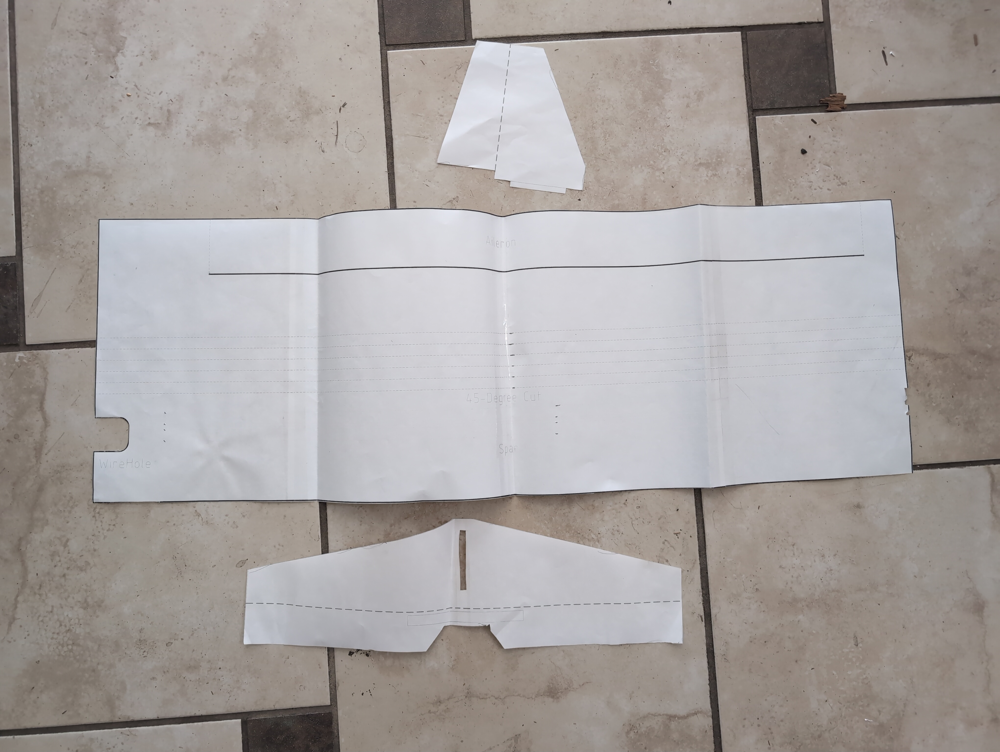
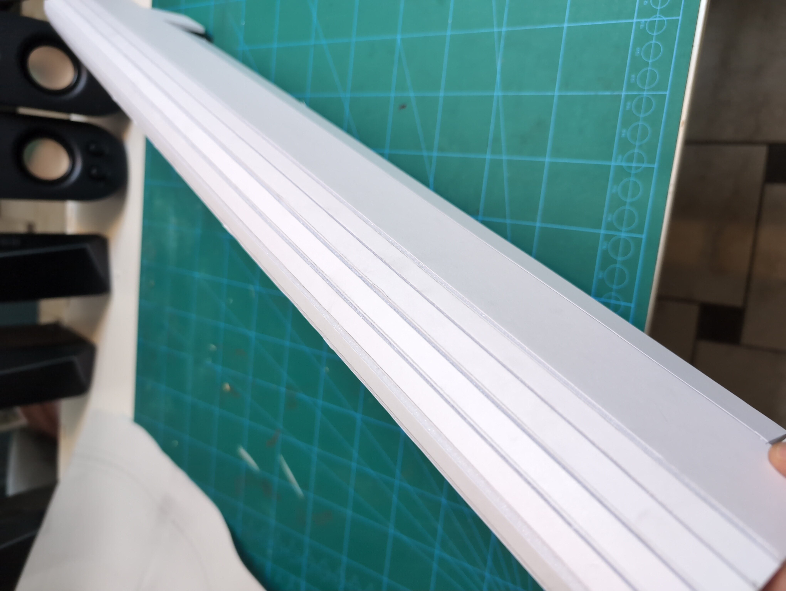

# BUILDING GUIDE

## Electronics Setup

- 30A ESC
- 800-1400KV Motor, with prop sizing (need to experimentally verify ideal motor size)
- Battery
- ELRS receiver

## 3D Printed Parts

PETG structural parts

LW-PLA info and settings

https://wiki.bambulab.com/en/knowledge-sharing/studio-settings-for-rc-models
Utilities/overture_pla_air_test.3mf

LW-PLA Parts
- front fairing
- rear fairing

M4 and M2 screws

MG09 (metal)
SG09 (plastic)

cutting jigs 3D prints

cutting guide, how to do half cuts and 45 degree cuts

## Wings and Tailfin

**Requirements**  
- one and a half pieces of 20"x30" 5mm Foamboard
- clear tape
- cutting surface
- cutting blade
- printer
- hot glue gun
- 5mm x 300mm or longer carbon fiber rod

The PDF files at `./CAD/Foam Tempaltes/PDF` are pre-sized to print at real scale. Make sure you are printing at 1:1 scale without margins or resizing.

Print and tape together the templates.  
  

You should have 4 templates, a left wing, and right wing, vertical and horizontal stabilizers.  
  

### Tailfin Assembly

TODO

### Wings

This project uses a similar construction method to the "armin wing"

[Armin Wing Part 1](https://www.youtube.com/watch?v=UNqFnzmm0vI)  
[Armin Wing Part 2](https://www.youtube.com/watch?v=RgBSbnZh_KM)  
[Armin Wing Part 3](https://www.youtube.com/watch?v=-z_mBiPw6z0)  
[Armin Wing Part 4](https://www.youtube.com/watch?v=idnT5eP5Snw)  

Alternative guide:
[Armin Wing Full Build Guide](https://www.youtube.com/watch?v=karr67ZYho4)  

However, because this design is modular, you can create your own custom airfoil with simple construction, like the [Kline-Fogelman airfoil](https://en.wikipedia.org/wiki/Kline%E2%80%93Fogleman_airfoil).  

Half-depth cuts along the bend lines of the airfoil:  
  

Carbon fiber spar positioned with foam spar. Notice the pencil markings copied over from the template:  
  

Carbon fiber spar sandwiched between foam spars:  
  

## Control Surfaces and Pushrods

1.2mm pushrods

## Final Assembly

## Tips and Tricks

**Print the Electronics Payload at an angle on the Bambu A1 Mini**
There may be temperature issues at the edges of the printing plate on the Bambu A1 mini. Try printing it at an angle to see if that helps at all.

**Do your wing balancing before you cut your push rods for the tailfin control surfaces to length**   
It is easier to adjust your balance by moving the tailfin length, so the length of your tailfin will be dependent on the balance. Once that is determined, then you can adjust the length of your pushrods.

**Use 1.2mm wire control rods for tail control surfaces**  
The tail control surfaces are far away from the servos, and 0.64mm piano wire will deform. 1.2mm wire is thick enough to withstand the forces, while also deflecting the desired amount along its path from the servo to the control surface.

#### TODO: all 3D parts labeled

#### Motor Mount

  
  

  