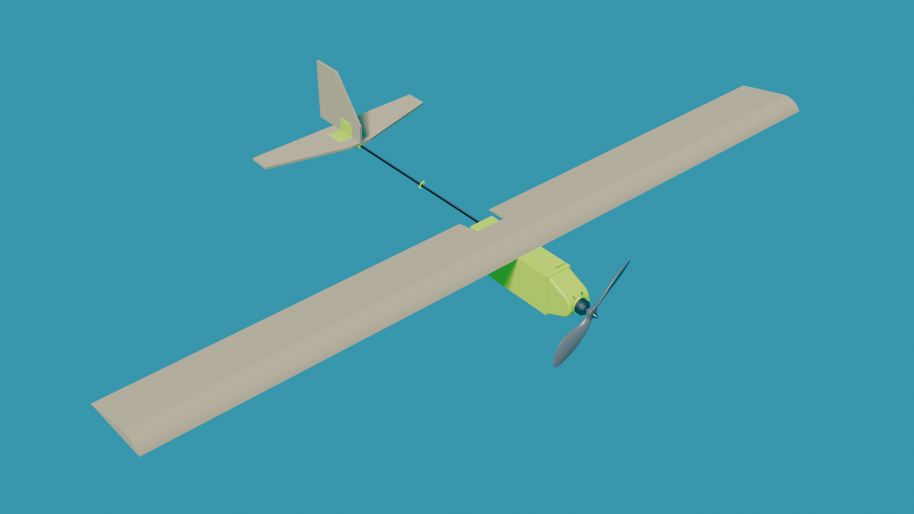
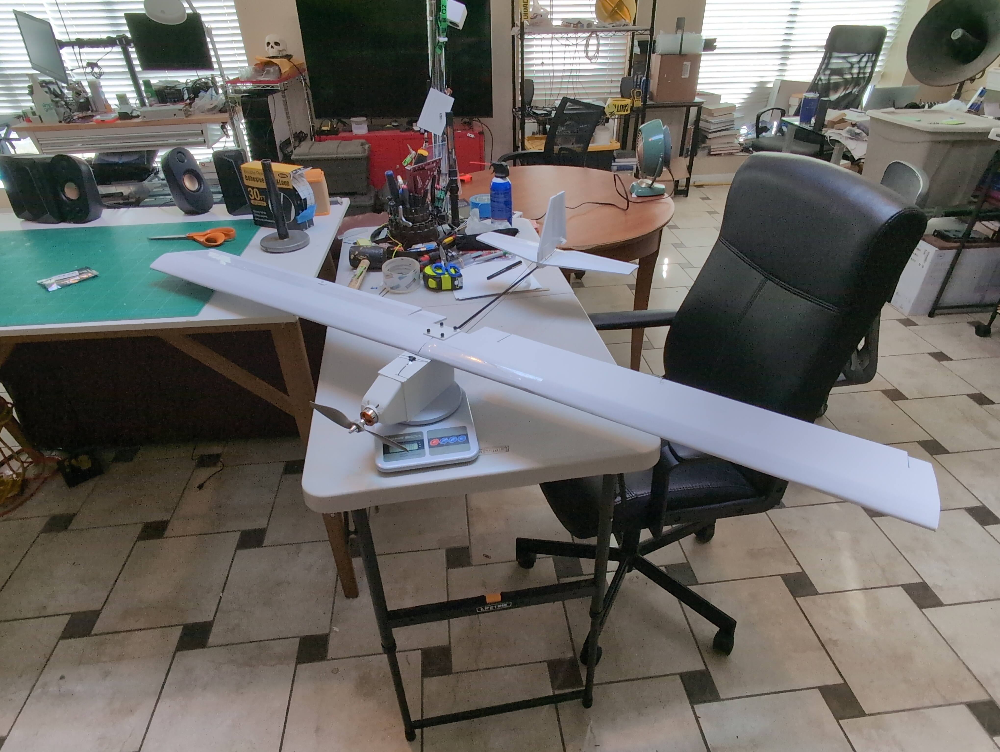

# MockingBird

    
  

Mockingbird is intended to be the cheapest and simplest drone to make. Here are some stats:

- $90 cost per unit (not counting autonomy or FPV)
- Printable on a Bambu A1 Mini
- 745g (not counting autonomy or FPV)
- 1680g Static Thrust
- ~8 hours to build (most of that is 3D printer time)
- Adjustable Center of Lift
- Modular design, swap out the wings, tailfin, motor, battery, receiver, etc.

More detailed specs available on the [specs page](./SPECS.md).

[Bill of Materials](./BILL_OF_MATERIALS.md)  
[Assembly Guide](./ASSEMBLY.md)  
[Electronics Setup](./ELECTRONICS_SETUP.md)  