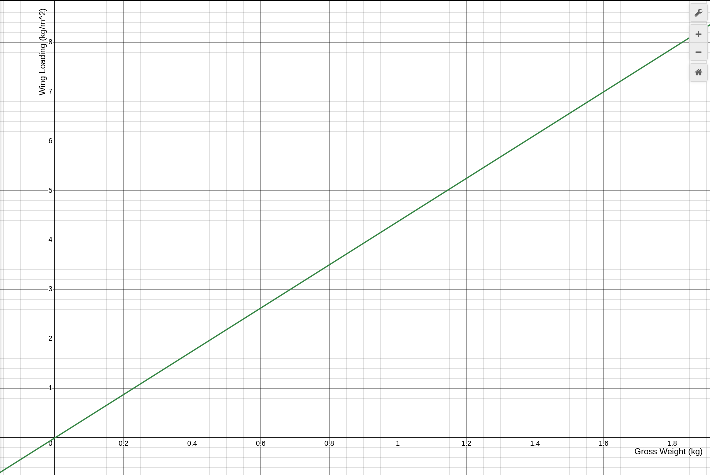
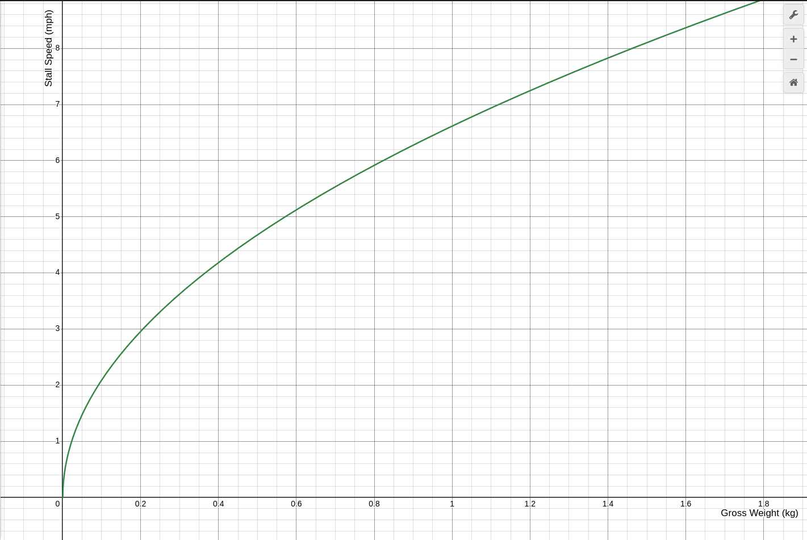

# Specs

| Parameter | Value |
|-----------|-------|
| Weight (with battery) | 745g |
| Estimated Static Thrust | 1686g |
| Max TWR | 2.26 |

*Thrust estimated with 3S battery, 1400KV motor, 8x4E prop*

# Wing Specs

| Parameter | Value |
|-----------|-------|
| Planform | Rectangular |
| Taper Ratio | 1 |
| Chord | 0.15m |
| Span | 1.524m |
| Area | 0.2286m² |
| Aspect Ratio | 10.15 |

---

## Aspect Ratio

Aspect ratio describes how long and narrow a wing is relative to its width. A high aspect ratio wing (like a glider) is long and thin, while a low aspect ratio wing (like a fighter jet) is short and wide.

```math
AR = \frac{S^2}{A} = \frac{Span}{Chord}
```

Where:
- **S** = Wingspan
- **A** = Wing area
- **Chord** = Wing width (for rectangular wings)

**Effects on performance:**
- **Higher AR** (like ours at 10.15): Lower induced drag, better lift-to-drag ratio, more efficient at slow speeds, better glide performance. Trade-off: requires stronger wing structure due to increased bending moment.
- **Lower AR**: Better roll rate and maneuverability, structurally stronger, but less aerodynamically efficient.

Our aspect ratio of ~10 is in the efficient range for slow-flying aircraft—similar to sailplanes and trainers.

---

## Wing Loading

Wing loading is the ratio of aircraft weight to wing area. It determines how "hard" the wing must work to generate lift and directly affects stall speed, handling, and flight characteristics.

```math
W_L = \frac{W}{A}
```

Where:
- **W** = Aircraft weight
- **A** = Wing area

**Effects on performance:**
- **Lower wing loading**: Slower stall speed, gentler handling, more affected by wind gusts, better for slow flight and easy landings.
- **Higher wing loading**: Faster stall speed, more stable in turbulence, better high-speed performance, but requires more runway.

---

## Stall Speed

Stall speed is the minimum airspeed at which the wing can generate enough lift to support the aircraft's weight. Below this speed, the wing stalls and lift drops dramatically.

Wing loading and stall speed are related by:

```math
W_L = \frac{1}{2} \rho V_{stall}^2 C_{L_{max}}
```

Solving for stall speed:

```math
V_{stall} = \sqrt{\frac{2 \cdot W_L}{\rho \cdot C_{L_{max}}}}
```

Where:
- **ρ (rho)** = Air density = 1.225 kg/m³ (at sea level)
- **C_L_max** = Maximum lift coefficient ≈ 1.5 (typical for flat-bottom airfoils)
- **W_L** = Wing loading (W/A)

---

## Glide Ratio (Estimated)

Glide ratio (L/D) is how far the aircraft travels forward for each unit of altitude lost—a 10:1 ratio means gliding 10m forward for every 1m of descent.

**Estimated glide ratio: ~8-10:1**

This estimate is based on:
- High aspect ratio (10.15) — reduces induced drag
- Rectangular planform — less efficient than tapered wings
- Flat-bottom airfoil — good for slow flight, not optimized for L/D
- Fuselage/pod — adds parasite drag

| Aircraft Type | Typical Glide Ratio |
|---------------|---------------------|
| Typical RC trainer | 6-10:1 |
| **This plane (estimate)** | **~8-10:1** |
| Cessna 172 | ~9:1 |
| High-performance sailplane | 30-60:1 |

At 8:1, from 100m altitude you'd glide about 800m in still air.

---

## Performance Curves

**Wing Loading at 745g: ~3.3 kg/m²**



**Stall Speed at 745g: ~5.8 m/s (13 mph)**



---

## References

- [Aspect Ratio (Aeronautics) - Wikipedia](https://en.wikipedia.org/wiki/Aspect_ratio_(aeronautics))
- [How Does Aspect Ratio Affect Your Wing? - Boldmethod](https://www.boldmethod.com/learn-to-fly/aircraft-systems/how-does-aspect-ratio-affect-aircraft-wings/)
- [Aircraft Wing Area and Aspect Ratio - AeroToolbox](https://aerotoolbox.com/intro-wing-design/)
- [NASA Geometry Definitions](https://www.grc.nasa.gov/www/k-12/VirtualAero/BottleRocket/airplane/geom.html)
